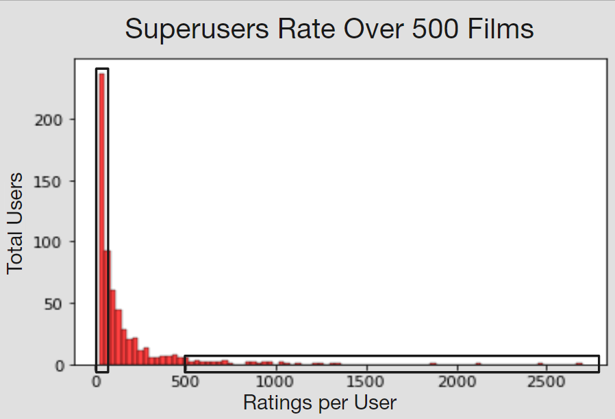

# Surprise Movie Recommendation System

## Business Problem

Flixnet is a large movie streaming platform that draws in many users every day. We are tasked with creating an app that recommends movies based on user ratings for the 20 most rated films on the platform. Based on the rating of these 20 films, we use ML to test and build the best model that provides the top 5 movie recommendations. 

## Data Understanding and Analysis

- 100k ratings from MovieLens 
610 users, 9700 movies
- All users rated at least 20 movies
- 610 unique users and 9724 different movies
- Between March 1996 and September 2018


Superusers are users who have reviewed more than 500 films. We choose this cut off based off of this histogram:



## Modeling

Our baseline model will be KNNBasic, a basic collaborative filtering algorithm, with no parameters. 

We also modeled using KNNBaseline, NMF, and SVD. After a grid search on each of these to determine best parameters, we determined the best model to be SVD because it has the lowest RMSE.


## Recommendation System Prieview

We deployed our recommendation system using Streamlit. Users can move sliders on to rate the 20 most rated films in our data. Following those 20 sliders, users can get recommendation of 5 films to watch next.


## Appendix

The complete analysis can be found in the <a href="Surprise_Movie_Recc_System.ipynb">Jupyter Notebook</a> and in our <a href="Movie Recommendation System.pdf">presentation</a>.

## Repository Structure ##

You are in the README.md.  'Surprise_Movie_Recc_System.ipynb' contains the jupyter notebook that explains our data science steps for you to replicate. The python file 'web_app.py' contains the recommendation system code to be deployed with Streamlit. 'Movie Recommendation System.pdf' contains our presentation slides that sums up important information for our audience.  In 'Data' you will be able to see the datasets we worked with.  Likewise, 'Images' will contain images used. 


```bash

├── Data                                    <- Data files used in this project

├── Images                                  <- Images and Graphs used in this project obtained from external and internal sources

├── .gitignore                              <- Contains list of files to be ignored from GitHub

├── Movie Recommendation System.pdf         <- Slide Presentation of the project

├── README.md                               <- Contains README file to be reviewed

├── web_app.py                              <- Contains python file of the final model deployable with Streamlit

└── Surprise_Movie_Recc_System.ipynb        <- Jupyter notebook of the project containing codes and analysis